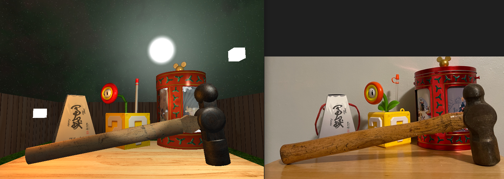
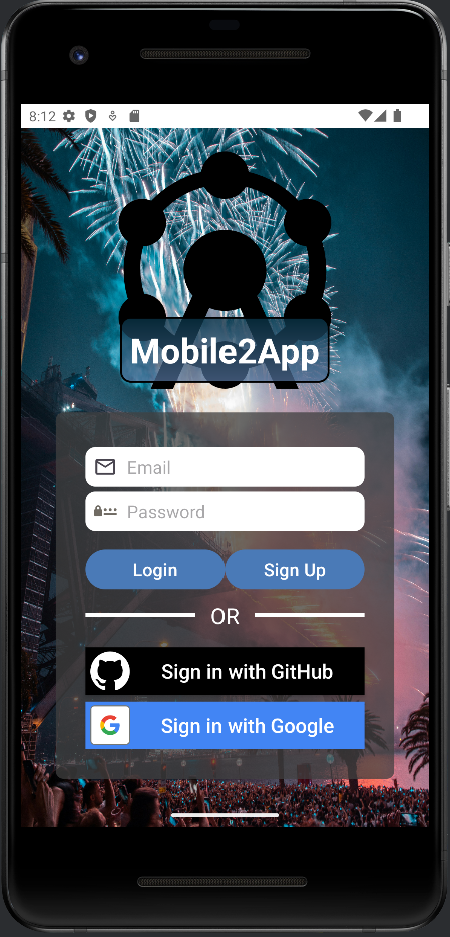

Here are some of the projects that I've worked on:  
### Narratives:
<a href="/docs/CS499-1.2-InitialProjectPlan.docx">Initial Plan</a>  

<a href="/docs/CS499-3.2-MilestoneTwo.docx">Software Engineering and Design</a>  

<a href="/docs/CS499-4.2-MilestoneThree.docx">Algorithms and Data Structures</a>  

<a href="/docs/CS499-5.2-MilestoneFour.docx">Databases</a>

## Project 1: OpenGL Project

This project involved creating a 3D scene using OpenGL. You can view the original and enhanced versions of the project below:

- [Original Version](https://github.com/mmgagujas/CS330-OpenGL-Project)
- [Enhanced Version](https://github.com/mmgagujas/OpenGL_3D_Scene)

Here's a preview of what the project looks like:

---

## Project 2: Android Studio App

This project involved creating an event tracking app using Android Studio. You can view the original and enhanced versions of the project below:

- [Original Version](https://github.com/mmgagujas/CS360-AndroidProject)
- [Enhanced Version](https://github.com/mmgagujas/Event_Tracking_App)

Here's a preview of what the app looks like:

---
# Code Review

<a href="/docs/CS499-2.2-MilestoneOne.docx">Code Review Script</a>
<iframe width="560" height="315" src="https://www.youtube.com/embed/ugIOkxuWH98?si=3a-c19s6jvQHzZof" title="YouTube video player" frameborder="0" allow="accelerometer; autoplay; clipboard-write; encrypted-media; gyroscope; picture-in-picture; web-share" referrerpolicy="strict-origin-when-cross-origin" allowfullscreen></iframe>